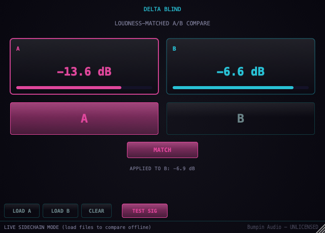

# Delta Blind

**A loudness-matched A/B comparison tool.**

Feed two versions of the same audio (a mix revision, a reference master, a
before/after) into Delta Blind's main input and sidechain, pick **A** or
**B** to hear it, and toggle **MATCH** on: B gets continuously (slow-
adapting) gain-trimmed to meet A's level, so a preference between the two
reflects a real difference, not just "louder sounds better" -- the same
bias a real blind listening test removes, hence the name.

Built with [JUCE](https://juce.com/), ships as VST3 / AU / Standalone on
macOS and Windows.

<p align="center">
  
</p>

<p align="center">
  <strong><a href="https://github.com/nabsei/delta-blind/releases/latest">⬇ Download the latest beta</a></strong> — macOS and Windows, free during the beta period.
  · <a href="CHANGELOG.md">Changelog</a>
</p>

<p align="center">
  Also listed on <a href="https://www.kvraudio.com/product/delta-blind-by-bumpin-audio">KVR Audio</a>.
</p>

## Why this exists

Level-matching before an A/B comparison is standard audio-engineering
practice: even a 1dB difference biases perception toward whichever version
is louder, regardless of which one is actually better. Doing it by hand
means measuring both sources, computing a trim, and re-checking every time
either version changes. Delta Blind automates that: it tracks a slow,
long-term RMS average of both sources and keeps B trimmed to match A in
real time, so switching between them is always a fair comparison.

Same audience as [Delta Zero](https://github.com/nabsei/delta-zero) (audio
engineers doing verification work, not creative one-knob effects), and
reuses its sidechain-bus / file-load-A-B / built-in-test-signal
architecture -- the DSP core is different (RMS-based level matching
instead of cross-correlation/null-test).

## Status

Early-stage / actively developed, free during the beta period. Like
Delta Zero, this repository is the actual source used to build the shipped
plugin -- the level-matching approach is correctness-driven, not a
tunable "secret sauce", so there's nothing withheld or redacted.

## Features

- Sidechain-based dual input: main = source A, sidechain = source B
- One-click A/B switching with a short click-free crossfade
- MATCH toggle: slow-adapting (~seconds, not chasing transients) gain
  correction keeps B's long-term level matched to A's
- Live dB readouts for both sources, plus the gain currently being
  applied to B
- Built-in test signal (B is a fixed +7dB louder than A, same tone) to
  hear MATCH working immediately, no routing required
- Offline file-comparison mode: LOAD A / LOAD B two audio files and loop
  through the same matching pipeline as live audio
- Denormal-safe processing, final safety ceiling (proportional rescale,
  never a per-sample clamp)
- Builds as **VST3**, **AU** (passes `auval` validation), and a
  **Standalone** app

## Tech stack

- C++17, [JUCE](https://github.com/juce-framework/JUCE) (audio processing + UI)
- CMake + Ninja

## Building

```bash
git clone --depth 1 https://github.com/juce-framework/JUCE.git libs/JUCE
cmake -B build -G Ninja -DCMAKE_BUILD_TYPE=Release
cmake --build build
```

On macOS, add `-DCMAKE_OSX_ARCHITECTURES="arm64;x86_64"` to the configure step
to build a universal binary (Apple Silicon + Intel) instead of the host-only
default. The official beta releases are built this way.

This produces a VST3, an AU component, and a standalone app under
`build/DeltaBlind_artefacts/Release/`, and installs the plugin formats into
your system's plugin folders automatically (`COPY_PLUGIN_AFTER_BUILD`).

## Project structure

```
Source/
  PluginEntry.cpp            JUCE plugin entry point
  DeltaMatchProcessor.*       AudioProcessor: sidechain bus, RMS matching, crossfade
  PluginEditor.*               Custom UI (A/B meters, match readout, HUD)
  DeltaMatchLookAndFeel.h      Custom LookAndFeel, shared with Delta Zero
CMakeLists.txt
```

## Open items

- [ ] Code signing / notarization for both macOS and Windows (current
      beta requires a one-time manual step on first install)
- [ ] Automated test suite (headless DSP + UI snapshot tools, private repo)
- [ ] Real-world testing in a DAW and on an actual Windows machine --
      so far only Standalone-on-macOS and CI compile checks
- [ ] Licensing gate for the post-beta paid release

## License

**This repository's source code:** MIT — see [LICENSE](LICENSE). Covers
the full source used to build the shipped plugin.

**The compiled plugin (downloads / releases):** free to use during the beta
period, not free to redistribute or resell. See the `TERMS.txt` included in
each release download for the full terms. A paid license will replace this
beta terms after the beta period ends.

## Also from Bumpin Audio

- [Delta Zero](https://github.com/nabsei/delta-zero) — phase-cancellation null-test / difference-checker (the first piece of the Delta line)
- [Montagem 808](https://github.com/nabsei/montagem-808)
- [Montagem Finisher](https://github.com/nabsei/montagem-finisher)
- [Montagem Widener](https://github.com/nabsei/montagem-widener)
- [Montagem Punch](https://github.com/nabsei/montagem-punch)
- [Yano Log](https://github.com/nabsei/yano-log)
- [Yano Finish](https://github.com/nabsei/yano-finish)
- [Yano Space](https://github.com/nabsei/yano-space)
- [Yano Swing](https://github.com/nabsei/yano-swing)
